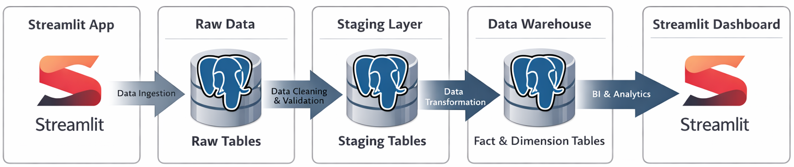
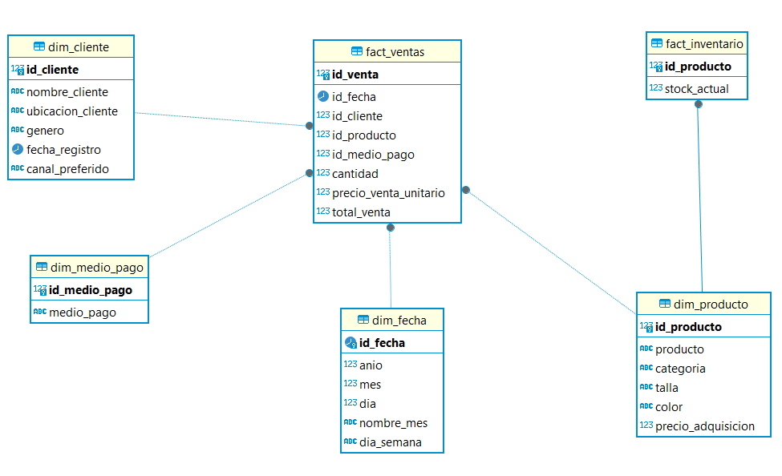

# 📊 DATAMARK - Plataforma de Automatización de Ventas e Inventarios.

## 🚀 Descripción del Proyecto

**DATAMARK** es una solución SaaS B2B en etapa MVP diseñada para
pequeños negocios de ropa y calzado en provincias del Perú.

El objetivo es **automatizar la gestión de ventas, inventarios y
clientes**, centralizando datos que normalmente se manejan en Excel o de
forma manual, y transformarlos en dashboards claros para la toma de
decisiones.

------------------------------------------------------------------------

# 🎯 Problema que Resuelve

Muchos pequeños negocios:

-   Gestionan ventas en Excel
-   No controlan correctamente inventarios
-   No tienen métricas claras
-   Cometen errores manuales
-   Toman decisiones sin datos estructurados

DATAMARK busca:

✔ Centralizar datos
✔ Automatizar limpieza y transformación
✔ Visualizar KPIs en dashboards
✔ Reducir errores operativos

------------------------------------------------------------------------

# 🏗 Arquitectura del Proyecto

El flujo actual del sistema sigue una arquitectura tipo Data Pipeline:

    Ingreso Manual / Excel
            ↓
    Schema RAW (Datos crudos)
            ↓
    Schema STAGING (Limpieza y validación)
            ↓
    Schema WAREHOUSE (Modelo final optimizado)
            ↓
    Dashboard

## 🔎 Diagrama de Arquitectura



Este diagrama muestra cómo los datos fluyen desde la ingesta inicial
hasta la capa analítica utilizada por el dashboard en Streamlit.

------------------------------------------------------------------------

# 🧱 Modelo Dimensional (Data Warehouse)

El schema `warehouse` implementa un modelo tipo **Star Schema**,
optimizado para análisis OLAP.

## 📊 Diagrama del Modelo



### Tablas de Hechos:

-   fact_ventas
-   fact_inventario

### Tablas Dimensión:

-   dim_cliente\
-   dim_producto\
-   dim_fecha\
-   dim_medio_pago

Este modelo permite:

✔ Análisis por cliente

✔ Análisis por producto\

✔ Análisis temporal\

✔ Análisis por medio de pago

------------------------------------------------------------------------

# 🗂 Estructura del Proyecto

    Dashboard-Ventas/
    │
    ├── etl.py
    ├── requirements.txt
    ├── data/
    │   └── ventas.csv
    │
    ├── sql/
    │   ├── create_schemas.sql
    │   ├── raw_tables.sql
    │   ├── staging_tables.sql
    │   └── warehouse_tables.sql
    │
    ├── images/
    │   ├── flujo.png
    │   └── modelado_Olap.png
    │
    ├── .github/
    │   └── workflows/
    │       └── ci.yml
    │
    └── README.md

------------------------------------------------------------------------

# 🛠 Tecnologías Utilizadas

### Backend / ETL

-   Python\
-   Pandas\
-   SQLAlchemy\
-   PostgreSQL

### Base de Datos

-   PostgreSQL\
-   DBeaver

### Control de Versiones

-   Git\
-   GitHub

### Automatización

-   GitHub Actions (CI/CD)

------------------------------------------------------------------------

# 🔄 Flujo ETL Implementado

El proceso ETL actual realiza:

### 1️⃣ Extract

-   Lectura de archivos CSV creados por el usuario.

### 2️⃣ Load (RAW)

-   Inserción directa al schema `raw`.

### 3️⃣ Transform (STAGING)

-   Limpieza de valores nulos\
-   Corrección de tipos de datos\
-   Validación de registros inconsistentes

### 4️⃣ Load Final (WAREHOUSE)

-   Inserción en tablas optimizadas para análisis.

------------------------------------------------------------------------

# 📊 Estado Actual del Proyecto

✔ Conexión exitosa a PostgreSQL
✔ Creación de schemas: raw, staging, warehouse
✔ Inserción de datos desde CSV
✔ Script ETL funcional
✔ Visualización en DBeaver
✔ Repositorio conectado a GitHub
✔ Pipeline básico de integración continua

------------------------------------------------------------------------

# ▶️ Cómo Ejecutar el Proyecto

## 1️⃣ Clonar repositorio

``` bash
git clone https://github.com/TU-USUARIO/TU-REPO.git
cd Dashboard-Ventas
```

## 2️⃣ Crear entorno virtual

``` bash
python -m venv venv
venv\Scripts\activate
```

## 3️⃣ Instalar dependencias

``` bash
pip install -r requirements.txt
```

## 4️⃣ Ejecutar ETL

``` bash
streanlit run main.py
```

------------------------------------------------------------------------

# 🔐 Variables de Entorno

Se recomienda usar un archivo `.env`:

    DB_HOST=
    DB_PORT=
    DB_NAME=
    DB_USER=
    DB_PASSWORD=
    GEMINI_API_KEY=

------------------------------------------------------------------------

# 🧪 Próximos Pasos

-   Integración con frontend (Streamlit o React)
-   Automatización completa desde botón "Ver Dashboard"
-   Implementación de pruebas automatizadas
-   Despliegue en la nube
-   Autenticación de usuarios

------------------------------------------------------------------------

# 📈 Impacto Esperado

-   Reducción de errores manuales
-   Mayor control de inventarios
-   Visualización clara de ventas
-   Mejores decisiones comerciales

------------------------------------------------------------------------

# 👩‍💻 Autora

Proyecto desarrollado como parte de un desafío técnico enfocado en
automatización y análisis de datos para pequeñas empresas.
